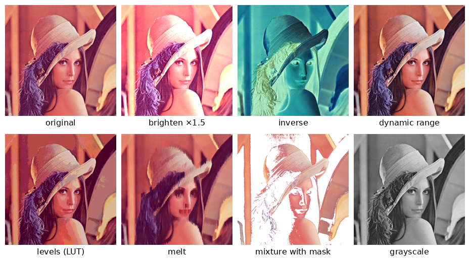

<div align="center">

# Image Processing in C

A small image-processing library for binary PGM and PPM images, written from scratch in C:<br>
point operations, look-up tables, channel operations and interpolated resizing.




<sub>Outputs of the program on the colour test image, all generated by <code>make run</code>.</sub>

</div>

<br>

| | |
|---|---|
| Context | First-year project, *Programmation impérative* course, ENSIIE (2024-2025) |
| Formats | Binary PGM (P5, grayscale) and PPM (P6, colour), 8-bit |
| Highlights | Manual memory management, flat pixel buffer, nearest-neighbour and bilinear resizing |

---

## Features

| Category | Functions |
|---|---|
| Input / output | `read_picture`, `write_picture` (comment lines handled) |
| Conversion | `convert_to_gray_picture`, `convert_to_color_picture`, `split_picture` / `merge_picture` (RGB channels) |
| Point operations | `brighten_picture`, `inverse_picture`, `normalize_dynamic_picture` (contrast stretching), `set_levels_picture` (quantisation through a look-up table) |
| Effects | `melt_picture` (darker pixels drip downward) |
| Combinations | `soustr_picture` (difference), `mult_picture` (product), `mix_picture` (blend of two images through a mask) |
| Resizing | `grow_size_*` and `reduce_size_*`, with nearest-neighbour and bilinear interpolation |
| Look-up tables | `create_lut`, `apply_lut`, `clean_lut` |
| File names | `filename.c` builds output names such as `Lenna_color_inverse.ppm` |

## Design notes

| | |
|---|---|
| Flat pixel buffer | An image is one contiguous byte array (`width × height × channels`); `pixel(...)` computes the byte offset, so every operation is a single loop over memory |
| Look-up tables | Level quantisation is expressed as a LUT allocated with `calloc` and applied to the whole buffer |
| Explicit ownership | Every function returns a new `picture` that the caller frees with `clean_picture`; the main program releases each intermediate result |
| Melt | At random positions, a pixel is replaced by the one above it when that one is darker; in colour, darkness is the sum of the R, G, B components |

More details on the implementation choices are in the report (French): [`docs/rapport.pdf`](docs/rapport.pdf).

## Build and run

Requirements: `gcc` and `make` (Linux, macOS, or WSL on Windows).

```bash
git clone https://github.com/bilal-jaiel/Image-Processing.git
cd Image-Processing
make          # builds bin/projet
make run      # applies every transformation to the test images, results in output/
```

To process your own images:

```bash
./bin/projet path/to/image.pgm path/to/image.ppm
```

Each input produces about fifteen files named `<name>_<operation>.<pgm|ppm>` in the current directory. The mixture operation reads its mask `Lenna_BW.pgm` from the current directory.

```
├── include/    headers: pictures.h, pixels.h, lut.h, filename.h
├── src/        implementation, and main.c which applies every operation
├── input/      test images: Lenna_gray.pgm, Lenna_color.ppm, Lenna_BW.pgm (mask)
├── docs/       report (PDF and LaTeX source), result gallery
└── Makefile
```

## Limitations

- Only binary PGM/PPM with 8-bit samples are supported (no ASCII P2/P3, no 16-bit).
- The mask used by the mixture operation is a hard-coded file name.
- Some `fgets` / `fread` return values are not checked, so malformed headers are not reported cleanly.

---

<div align="center">
<sub>Bilâl Jaiel · <a href="https://github.com/bilal-jaiel">GitHub</a> · <a href="https://www.linkedin.com/in/bilal-jaiel/">LinkedIn</a> · MIT license</sub>
</div>
